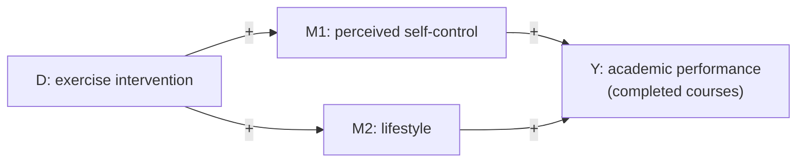
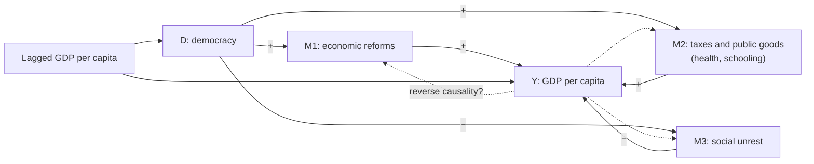

# Lecture 1: Exercises

[Back to notes](notes.md)

> The solutions below are my own. Check them against the official `Design-of-Experiments---Exercise-Solutions.html`.

---

## Exercise 1.1: Scientific studies

Read the abstracts and

1. classify each study as qualitative or quantitative
2. say whether experimental methods are used, and if yes, which treatment is manipulated

The slide title says "four studies", but the exercise contains five.

### The studies in short

| #   | Summary                                                                                                                                                                                                                                                                                                                        |
| --- | ------------------------------------------------------------------------------------------------------------------------------------------------------------------------------------------------------------------------------------------------------------------------------------------------------------------------------ |
| 1   | Randomized field experiment with a Swiss health insurer. A letter tells people they can get a flu shot in selected pharmacies. One year later, the letter is sent again to half of the original recipients and stopped for the other half. The nudge works in the short run but has no lasting or additive effect in year two. |
| 2   | 122 interviews at an elite U.S. university about how students see the effects of extracurricular activities. Using Bourdieu's field theory, the author finds students see parallels between their clubs and real workplaces and learn to navigate hierarchies there.                                                           |
| 3   | Nationwide field experiment: emails from fictitious parents to 9,313 German childcare centers. The sender is randomly the mother or the father. Mothers get shorter and less positive replies, while the response rate does not differ by gender.                                                                              |
| 4   | Video interviews with 22 health workers in the U.S. (April–July 2020), analysed thematically with the Social-Ecological Model. Four themes: institutional support, working under pressure, political tensions, maintaining hope.                                                                                               |
| 5   | Data from thousands of economics seminars, job market talks and conferences. Interruptions are measured with human coders and audio algorithms. Women are interrupted more, also with controls for presenter, paper and audience.                                                                                              |

### Solution

| #   | Type         | Experiment?                                  | Manipulated treatment                                                                                   | Outcome                                             |
| --- | ------------ | -------------------------------------------- | ------------------------------------------------------------------------------------------------------- | --------------------------------------------------- |
| 1   | Quantitative | Yes, randomized field experiment             | Informational letter (nudge) about vaccination in pharmacies. Year 2: repeating vs. stopping the letter | Flu vaccination rate                                |
| 2   | Qualitative  | No                                           | –                                                                                                       | Students' perceptions of extracurricular activities |
| 3   | Quantitative | Yes, field experiment (correspondence study) | Gender of the parent sending the email (mother vs. father)                                              | Response rate, length and tone of the reply         |
| 4   | Qualitative  | No                                           | –                                                                                                       | Health workers' experiences and concerns            |
| 5   | Quantitative | No, observational                            | – (presenter gender is compared but not assigned by the researchers)                                    | Number, tone and type of interruptions              |

### Points worth noting

- **Study 2:** 122 interviews is a lot for a qualitative study. Sample size alone does not make a study quantitative. What counts is that the data is interpreted, not analysed statistically.
- **Study 3:** the treatment is a characteristic (gender), but the researchers still manipulate it by randomly choosing the sender of each email. That is what makes it an experiment.
- **Study 5:** large dataset and algorithms, but nothing is manipulated. The authors use control variables instead of randomization to deal with confounders.
- **Study 1:** the key word is "randomized". There are two treatment stages: the first letter, then the random split into "repeat" and "stop".

---

## Exercise 1.2a: Mechanisms of exercise on academic performance (Cappelen et al. 2026)

Read the excerpt and draw a causal graph.

**What the excerpt says**

- The exercise intervention strongly improves perceived **self-control** and **lifestyle**, both known to matter for learning.
- A pre-specified heterogeneity analysis splits students by whether they were below the median at baseline in self-control, lifestyle, happiness and study hours. Treatment effects are much larger for students who struggled in these dimensions.
- Students who struggled in all four dimensions show an effect of **0.5 standard deviations** in completed courses.
- Conclusion: the intervention improves academic performance by changing self-control and lifestyle.

### Solution

- Self-control and lifestyle are the **mediators**. The intervention changes them, and they in turn change performance.
- The baseline values of self-control, lifestyle, happiness and study hours are not mediators. They determine **how large** the effect is for a given student (effect heterogeneity). That is why they do not appear as nodes on the path from D to Y.

---

## Exercise 1.2b: Mechanisms of democracy on growth (Acemoglu et al. 2019)

Draw a causal graph for the channels described in the excerpt.

**What the excerpt says**

- Democracies seem to enact **economic reforms** that help growth.
- Democracies raise **more taxes** and invest more in **public goods** related to health and schooling, which may raise growth.
- Democracy seems to **reduce social unrest**, which could also help growth.
- The authors cannot prove these are the most important channels, because the channels could themselves be outcomes of growth. Since they increase after democratization even when controlling for lagged GDP per capita, they are strong candidates.

### Solution

- **M1 and M2** work in the same direction: democracy raises them, and they raise growth.
- **M3** has two negative signs: democracy lowers unrest, and unrest lowers growth. The effect of democracy through this channel is therefore **positive**.
- **Lagged GDP** affects both democracy and current GDP, so it is a confounder. The authors control for it.
- The **dotted arrows** show the caveat from the excerpt: growth could also drive reforms, taxes and unrest. This is why the channels are only "prime candidates" and not proven mechanisms.
- The paper's abstract also names **investment in capital** as a channel. It is not in this excerpt, so it is left out of the graph.
