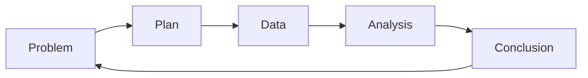
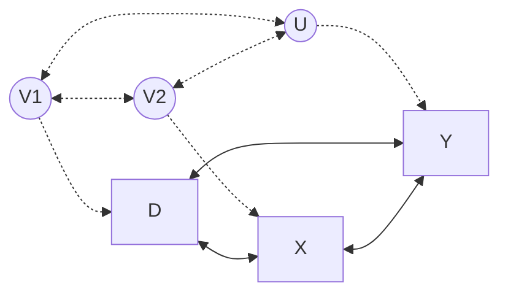
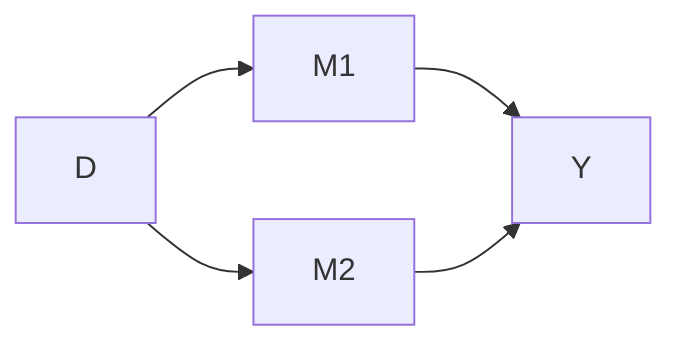
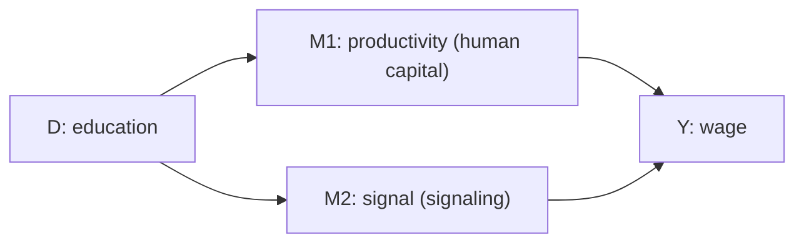

# Lecture 1: Scientific methods

**Date:** 17 Sep 2026 (onsite) · **Lecturer:** Lukas Schmid · [Exercises](exercises.md)

## Contents

1. [Research questions](#1-research-questions)
2. [Science](#2-science)
3. [Research and the PPDAC cycle](#3-research-and-the-ppdac-cycle)
4. [Quantitative vs. qualitative research](#4-quantitative-vs-qualitative-research)
5. [Theory and empirical evidence](#5-theory-and-empirical-evidence)
6. [Causal graphs](#6-causal-graphs)
7. [Experimental methods](#7-experimental-methods)
8. [Key terms](#key-terms)

---

## 1. Research questions

The lecture opens with four research questions. Each one asks whether a variable X has an effect on an outcome Y.

| #   | Research question                                    | X                | Y                    |
| --- | ---------------------------------------------------- | ---------------- | -------------------- |
| 1   | Does exercising lead to better academic performance? | exercise         | academic performance |
| 2   | Do monetary payments increase vaccination rates?     | monetary payment | vaccination rate     |
| 3   | What is the effect of income on work effort?         | income           | work effort          |
| 4   | Do good ratings increase revenues?                   | ratings          | revenue              |

The slides draw a positive arrow for all four. For question 3 the direction is not obvious in advance: more income could raise effort or lower it, which the "more / less" picture on the slide hints at.

## 2. Science

- Common definition: science is a systematic discipline that builds and organizes knowledge as testable hypotheses and predictions about the universe (Wikipedia).
- Caveat: some of today's scientific knowledge will turn out to be wrong at some point.
- Definition via methods (King, Keohane and Verba 1994): what makes something science are its **methods and rules**, not its subject. These methods can be applied to almost anything.
- Two ways to divide science:
  - **Substantive:** natural sciences, social sciences, formal sciences
  - **Methodological:** quantitative and qualitative methods

## 3. Research and the PPDAC cycle

- **Research** is the process of doing science by gathering evidence.
- **Evidence** for a hypothesis, proposition or theory is whatever supports it.

The PPDAC cycle (Spiegelhalter 2019) describes research as a loop:

| Stage          | What happens                                                                  |
| -------------- | ----------------------------------------------------------------------------- |
| **Problem**    | Understand and define the problem. How do we go about answering the question? |
| **Plan**       | What to measure and how, study design, recording, collecting                  |
| **Data**       | Collection, management, cleaning                                              |
| **Analysis**   | Sort data, build tables and graphs, look for patterns, generate hypotheses    |
| **Conclusion** | Interpretation, conclusions, new ideas, communication                         |

## 4. Quantitative vs. qualitative research

|                   | Quantitative                                                                 | Qualitative                                                                                                  |
| ----------------- | ---------------------------------------------------------------------------- | ------------------------------------------------------------------------------------------------------------ |
| Measurement       | Concepts measured as numbers or categories (e.g. democracy, economic output) | Phenomena interpreted through the meanings people give them                                                  |
| Cases             | Many                                                                         | Few                                                                                                          |
| Goal              | Connect concepts (e.g. impact of democracy on economic output)               | Make sense of phenomena in their natural setting                                                             |
| Methods           | Statistical methods such as regression                                       | Interviews, focus groups, field observation                                                                  |
| Inference         | From sample to population                                                    | No statistical inference                                                                                     |
| Example questions | Does democracy increase GDP?                                                 | Why did Apple lead the tablet market in the 2010s? How did democracy in Indonesia develop under Joko Widodo? |

### Example 1.1: Quantitative (Acemoglu et al. 2019, "Democracy Does Cause Growth")

- **Finding:** democracy has a positive effect on GDP per capita. Democratization raises GDP per capita by about **20% in the long run**.
- **Data:** annual panel of 175 countries, 1960–2010 (not all variables available for all years).
- **Method:** dynamic panel with country fixed effects, controlling for the dynamics of GDP, which would otherwise confound the effect.
- **Measurement error:** the authors build a new consolidated, dichotomous (0/1) democracy indicator from existing measures.
- **Robustness:** similar results with propensity score reweighting and with an instrumental variable based on regional waves of democratization.
- **Channels:** more investment in capital, schooling and health. Effects are similar across levels of development.

### Example 1.2: Qualitative (Mujani and Liddle 2021, "Indonesia: Jokowi Sidelines Democracy")

- Voters and elites in Indonesia are strongly committed to democracy, but President Jokowi has put economic development first and democracy second.
- Under his rule free elections came under threat, civil liberties declined, anti-corruption bodies and legislative checks were weakened and the military gained influence in civilian affairs.
- Local officials whose terms end before the 2024 elections are replaced by his appointees, and the number of offices contested in 2024 puts a heavy load on election officials.
- No numbers, no statistical model. The argument comes from the interpretation of one case.

## 5. Theory and empirical evidence

| Theory                                             | Empirical evidence                       |
| -------------------------------------------------- | ---------------------------------------- |
| What is the proposed relationship between X and Y? | Is there a relationship between X and Y? |
| Under which assumptions do we observe it?          | If yes, what does it look like?          |

### Example: left-digit bias in the used car market (Lacetera, Pope and Sydnor 2012)

**Theory.** Buyers pay limited attention to the digits after the leftmost one of the odometer reading. A car's true value falls linearly with mileage, but the _perceived_ value behaves differently:

- between two 10,000-mile thresholds the value falls with slope −α(1 − θ), flatter than the true slope −α
- at every 10,000-mile threshold the value drops discretely by αθ · 10,000
- θ measures how inattentive buyers are (θ = 0 means full attention, the perceived value equals the true value)

**Evidence.** Plotting the average sale price against mileage (rounded to 500 miles) shows exactly this pattern: prices fall with mileage and jump down at each 10,000-mile mark.

## 6. Causal graphs

Causal graphs encode causal assumptions visually and help build intuition about causality.

- A graph has **nodes** (observed and unobserved variables) and **lines**.
- **Solid lines** are direct causal effects.
- **Dotted lines** connect two nodes of which at least one is unobserved.
- V1, V2 and U are **unobserved** and determined outside the model.

Graph from slide 15:

Reading it:

- D (treatment), Y (outcome) and X (a covariate) are observed.
- The solid arrows between D, X and Y point both ways, so the graph does not yet commit to a direction.
- Each observed variable has its own unobserved driver (V1 → D, V2 → X, U → Y), and these unobserved drivers are linked with each other.

### Mediators

Causal graphs also show **through which channels** (mediators, mechanisms) a treatment D affects Y.

#### Example 1.3: Education and wages

People with more education earn more. This pattern shows up in many countries. The open question is the mechanism.

| Theory                   | Mechanism                                                                    | Does education raise productivity? |
| ------------------------ | ---------------------------------------------------------------------------- | ---------------------------------- |
| **Human capital theory** | Education raises productivity (M1), which lets people negotiate higher wages | Yes                                |
| **Signaling theory**     | Education only signals that someone is productive (M2)                       | No                                 |

## 7. Experimental methods

- Outcomes are driven by many processes. Academic success depends on ability, effort, luck and more, not only on exercise.
- To find out how much the variable of interest matters, we need to **intervene** in these processes, which means running experiments.
- Properties of experiments:
  - they **isolate one specific determinant** of the outcome
  - they are **fallible** and can be updated or replaced for fairly simple reasons

### Example 1.4: Galileo in Pisa

Until the end of the 16th century, Aristotle's axiom was accepted: heavier bodies fall faster. Galileo claimed weight does not affect the speed of falling bodies. Professors ridiculed him, so he ran a public experiment on the Leaning Tower of Pisa, dropping bodies of different weight at the same time.

Side note: historians doubt the Pisa demonstration took place as told. Galileo's actual evidence came mainly from inclined-plane experiments.

---

## Key terms

| Term                 | Meaning                                               |
| -------------------- | ----------------------------------------------------- |
| X → Y                | Proposed effect of X on Y, sign above the arrow       |
| D                    | Treatment, the variable whose effect we want to know  |
| Y                    | Outcome                                               |
| X (in causal graphs) | Observed covariate                                    |
| M                    | Mediator (channel, mechanism) between D and Y         |
| U, V                 | Unobserved variables, determined outside the model    |
| Evidence             | Whatever supports a hypothesis, proposition or theory |
| Research             | Doing science by gathering evidence                   |

## References

- Acemoglu, D., Naidu, S., Restrepo, P. and Robinson, J. A. (2019). Democracy Does Cause Growth. _Journal of Political Economy_ 127(1): 47–100.
- Cappelen, A. W., Charness, G., Ekström, M., Gneezy, U. and Tungodden, B. (2026). Exercise Improves Academic Performance. _Journal of Political Economy_ 134(1).
- King, G., Keohane, R. O. and Verba, S. (1994). _Designing Social Inquiry: Scientific Inference in Qualitative Research_. Princeton University Press.
- Lacetera, N., Pope, D. G. and Sydnor, J. R. (2012). Heuristic Thinking and Limited Attention in the Car Market. _American Economic Review_ 102(5): 2206–2236.
- Mujani, S. and Liddle, R. W. (2021). Indonesia: Jokowi Sidelines Democracy. _Journal of Democracy_ 32(4): 72–86.
- Spiegelhalter, D. (2019). _The Art of Statistics: How to Learn from Data_. Penguin Books.
