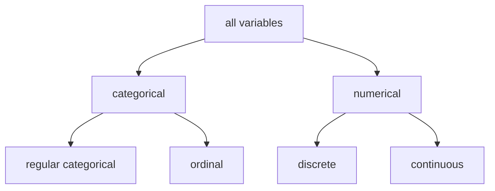
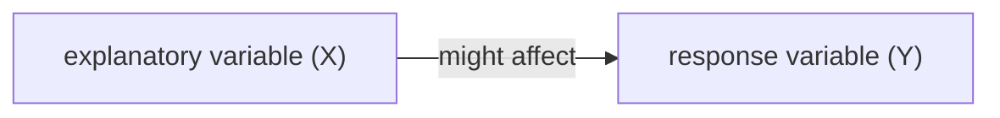
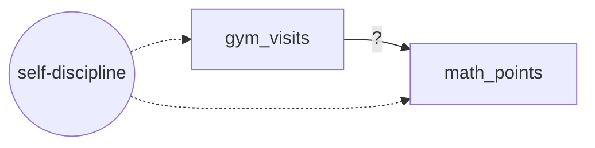

# Lecture 2: Relationship between variables

**Date:** 24 Sep 2026 (online) · **Lecturer:** Lukas Schmid · [Exercises](exercises.md)

## Contents

1. [Motivation](#1-motivation)
2. [Variable types](#2-variable-types)
3. [Levels of measurement](#3-levels-of-measurement)
4. [Relationships between variables](#4-relationships-between-variables)
5. [Functional form](#5-functional-form)
6. [Data types](#6-data-types)
7. [Application: exercise and academic performance](#7-application-exercise-and-academic-performance)
8. [Key terms](#key-terms)

---

## 1. Motivation

**Example 2.1:** You are interested in the factors that affect academic performance. How could you study this question, and what would you need to know to understand the relationship?

The rest of the lecture answers this in three steps:

| Question                                                 | Section                                          |
| -------------------------------------------------------- | ------------------------------------------------ |
| Which variables do we have and what can we do with them? | Variable types, levels of measurement            |
| How do two variables move together?                      | Relationships between variables, functional form |
| How is the data structured across units and time?        | Data types                                       |

Slide 4 labels the survey "Example 2.2", all later slides call it "Example 2.1 (cont.)". I use 2.1 for the survey and 2.2 for GDP and life expectancy.

## 2. Variable types

### The survey

A survey among the students of an introductory math course at HSLU (86 students).

| Variable       | Survey question                                                 |
| -------------- | --------------------------------------------------------------- |
| `math_points`  | How many points did the student achieve? (from student records) |
| `gender`       | What is your gender?                                            |
| `gym_visits`   | How many times did you go to the gym during the last month?     |
| `countries`    | How many countries have you visited during the last year?       |
| `class_rating` | How do you rate the class?                                      |

- Each **row** is an **observation** (one student).
- Each **column** is a **variable**, also called feature.

First six observations:

| id  | gender | math_points | gym_visits | countries | class_rating |
| --- | ------ | ----------- | ---------- | --------- | ------------ |
| 1   | male   | 130.1       | 10         | 4         | very good    |
| 2   | female | 100.5       | 2          | 7         | bad          |
| 3   | female | 90.9        | 0          | 1         | medium       |
| 4   | female | 141.7       | 14         | 5         | good         |
| 5   | male   | 120.5       | 12         | 1         | very bad     |
| 6   | female | 92.8        | 0          | 9         | medium       |

### Types of variables



The slide only shows the tree. The definitions below are the standard ones.

| Type                | Meaning                                                                   | Example                             |
| ------------------- | ------------------------------------------------------------------------- | ----------------------------------- |
| Regular categorical | Categories without a natural order                                        | gender, colour                      |
| Ordinal             | Categories with a natural order, the distance between them is not defined | class rating (very bad … very good) |
| Discrete            | Countable numbers, usually the result of counting                         | number of gym visits                |
| Continuous          | Any value within an interval, usually the result of measuring             | math points, weight                 |

### Classifying the survey variables (slide 7)

| Variable       | Type                | Why                                                                                       |
| -------------- | ------------------- | ----------------------------------------------------------------------------------------- |
| `gender`       | regular categorical | female and male have no order                                                             |
| `math_points`  | continuous          | points can take any value in a range, e.g. 130.1                                          |
| `gym_visits`   | discrete            | a count: 0, 1, 2, …                                                                       |
| `countries`    | discrete            | a count                                                                                   |
| `class_rating` | ordinal             | very bad < bad < medium < good < very good, but "good" minus "medium" has no defined size |

## 3. Levels of measurement

The variable type is the basis for the scale level. The higher the scale, the more information a variable carries.

| Scale    | Interpretation of values                                          | Mean value      | Example                     | Allowed operations     |
| -------- | ----------------------------------------------------------------- | --------------- | --------------------------- | ---------------------- |
| Nominal  | equal or different                                                | mode            | gender, colours             | =, ≠                   |
| Ordinal  | greater, less or equal                                            | median          | height, class rating        | =, ≠, <, >             |
| Interval | differences can be compared                                       | arithmetic mean | grades, temperature in °C   | =, ≠, <, >, +, −       |
| Ratio    | absolute zero point, ratios and percentage comparisons make sense | geometric mean  | math points, salary, weight | =, ≠, <, >, +, −, ×, ÷ |

The last column is my addition. How to read the table:

- Each scale allows everything the scales above it allow. The "mean value" column names the most informative average a scale supports. The mode works on every scale, the median from ordinal upwards.
- Mapping to the variable types: regular categorical → nominal, ordinal → ordinal, numerical → interval or ratio.
- **Interval vs. ratio:** 20 °C is not "twice as warm" as 10 °C, because 0 °C is a convention and not the absence of temperature. In Kelvin, temperature would be ratio. 100 math points are twice as many as 50.
- The geometric mean only works for positive values.
- **Height** as an ordinal example is odd. Height in cm is ratio (0 cm is a real zero, 180 cm is 1.2 times 150 cm). It is only ordinal if recorded as categories such as small, medium, tall.

### Which statements are correct? (slide 9)

| Statement                                                                             | Correct? | Why                                                                                                                                                                                                  |
| ------------------------------------------------------------------------------------- | -------- | ---------------------------------------------------------------------------------------------------------------------------------------------------------------------------------------------------- |
| "There are 45 women and 41 men in the data."                                          | Yes      | Counting categories works on a nominal variable. The cross table on slide 13 gives 45 women (1+12+6+15+11) and 41 men (9+8+8+9+7). The six rows on slide 9 alone cannot show this.                   |
| "The arithmetic mean of the class rating is medium."                                  | No       | Class rating is ordinal. An arithmetic mean needs at least an interval scale. The right measure is the median (or the mode). In the full data the median is in fact "medium" and the mode is "good". |
| "The average math points among the students is 113.6."                                | Yes      | Math points are ratio scale, so the mean is fine. The full data gives 113.63. The six rows on the slide alone give 112.75, so the statement is about all 86 students.                                |
| "The first observation liked the course four times more than the second observation." | No       | "very good" and "bad" are ordinal categories. Statements like "four times more" need a ratio scale.                                                                                                  |

## 4. Relationships between variables

### 4.1 Explanatory and response variables

From theory, decide which variable in a pair is suspected to affect the other.



- The labels only keep track of which variable we suspect affects the other. Even if X and Y are associated, the relationship is **not necessarily causal**.
- Other names for X: independent variable, regressor
- Other names for Y: dependent variable, explained variable, regressand

The tool depends on the variable types:

| Pair of variables         | Graphical                                             | Numeric           |
| ------------------------- | ----------------------------------------------------- | ----------------- |
| categorical + categorical | –                                                     | contingency table |
| categorical + numerical   | scatter plot per group (box plot in the lecture code) | mean per group    |
| numerical + numerical     | scatter plot                                          | –                 |

### 4.2 Two categorical variables: contingency table

**Definition 2.1:** A contingency table of absolute frequencies has the form

```
          y1    ...   ym   |
   x1     h11   ...   h1m  |  h1.
   x2     h21   ...   h2m  |  h2.
   ...    ...         ...  |  ...
   xk     hk1   ...   hkm  |  hk.
   --------------------------------
          h.1   ...   h.m  |  n
```

- h_ij = h(x_i, y_j) is the absolute frequency of the combination (x_i, y_j)
- h_1., …, h_k. are the **marginal frequencies of X** (row sums)
- h_.1, …, h_.m are the **marginal frequencies of Y** (column sums)
- n is the total number of observations

**Example:** gender and class rating, with `tabyl()` from the `janitor` package:

```r
library(janitor)
df_math %>% tabyl(gender, class_rating)
```

```
 gender very bad bad medium good very good
 female        1  12      6   15        11
   male        9   8      8    9         7
```

The two groups have different sizes (45 women, 41 men). To compare them, look at the shares within each gender (row percentages), not at the raw counts:

```r
df_math %>%
  tabyl(gender, class_rating) %>%
  adorn_percentages("row") %>%
  adorn_pct_formatting(digits = 1)
```

| gender | very bad | bad   | medium | good  | very good |
| ------ | -------- | ----- | ------ | ----- | --------- |
| female | 2.2%     | 26.7% | 13.3%  | 33.3% | 24.4%     |
| male   | 22.0%    | 19.5% | 19.5%  | 22.0% | 17.1%     |

`Lecture Codes.R` uses `adorn_percentages("all")` instead, which divides every cell by all 86 students. That shows the joint distribution but makes the gender comparison harder to read.

**Pattern:**

- Women rate the class better: 58% of women say good or very good, compared with 39% of men.
- 9 of the 10 "very bad" ratings come from men.
- Men's ratings are spread almost evenly across all five categories. Women's ratings cluster at good and very good, with a second, smaller group at "bad".

### 4.3 Categorical and numerical variable

- Graphical: scatter plot for each group
- Numeric: mean per group

```r
ggplot(data = df_math, aes(x = gender, y = math_points)) +
  geom_point() +
  theme_bw()
```

What the plot shows (slide 15): two vertical columns of points, one per gender, each spread between roughly 55 and 175 points. The two ranges overlap almost completely. Points close to each other merge, and the plot shows no summary, so a difference between the groups is hard to see by eye.

The numeric way:

```r
df_math %>%
  group_by(gender) %>%
  summarize(math_points_mean = mean(math_points))
```

```
# A tibble: 2 × 2
  gender math_points_mean
  <chr>             <dbl>
1 female             121.
2 male               105.
```

- Women score about 16 points more on average (121.1 vs. 105.4).
- The spread within each group is larger than this gap (standard deviation around 30 points in both groups). The mean alone hides that.
- `Lecture Codes.R` also draws a box plot (`geom_boxplot()`), which shows median and spread per group in one picture. Medians: 119.0 (female) vs. 101.1 (male).

**Reading R output:** a tibble prints about three significant digits. `121.` is 121.08 rounded, the trailing dot says that decimals were cut off. `<chr>` marks a character variable, `<dbl>` a numeric one (double).

### 4.4 Two numerical variables

The classical tool is a scatter plot.

```r
ggplot(data = df_math, aes(x = gym_visits, y = math_points)) +
  geom_point() +
  theme_bw(base_size = 24)
```

What the plot shows (slide 16):

- A clear **positive** relationship: more gym visits go together with more math points.
- The points lie close to a straight line, so the relationship looks **linear**.
- The 23 students without a gym visit form a column at x = 0, all between 56 and 94 points.

This is an association, not a causal effect. Students who go to the gym often might also be more disciplined, and discipline could raise math points on its own. One possible third variable:



The Cappelen et al. (2026) experiment in [section 7](#7-application-exercise-and-academic-performance) is built to get around exactly this.

## 5. Functional form

A relationship can take different shapes. The slides show the graphs, the equations are the standard polynomial forms.

| Form      | Equation                  | Shapes on the slides                                                                                                            |
| --------- | ------------------------- | ------------------------------------------------------------------------------------------------------------------------------- |
| Linear    | y = a + b·x               | straight line, rising (b > 0) or falling (b < 0)                                                                                |
| Quadratic | y = a + b·x + c·x²        | one turning point: inverted U (c < 0, peak around x = 7.5) or U shape (c > 0, minimum around x = 7.5)                           |
| Cubic     | y = a + b·x + c·x² + d·x³ | can bend twice. On the slides: a curve that rises more and more slowly, and an asymmetric U that falls gently and rises steeply |

- A quadratic curve is symmetric around its turning point. The asymmetric curve on slide 19 (right) needs the cubic term.
- Why it matters: if the true relationship is curved and you fit a straight line, you describe it wrongly. Functional form comes back in lecture 4 as a threat to internal validity.

### Example 2.2: GDP per capita and life expectancy

Scatter plot of GDP per capita (in 1000 USD) against life expectancy at birth, World Bank data for 192 countries.

```r
ggplot(df_gdp_life_expectancy, aes(gdppc, life_expectancy)) +
  geom_point(size = 3) +
  ylab("Life expectancy at birth") + xlab("GDP per capita (in 1000 USD)") +
  theme_bw()
```

**Pattern:** life expectancy rises steeply with GDP per capita at low incomes and flattens out at around 80–85 years for rich countries. The relationship is positive but **not linear**. It is concave, with diminishing returns. My own grouping of the same data makes this visible:

| GDP per capita (1000 USD) | Countries | Mean life expectancy |
| ------------------------- | --------- | -------------------- |
| 0–5                       | 74        | 67.4                 |
| 5–10                      | 33        | 72.8                 |
| 10–20                     | 23        | 75.6                 |
| 20–40                     | 31        | 78.9                 |
| above 40                  | 31        | 82.1                 |

The first 5,000 USD step goes with +5.4 years. The last step, which spans tens of thousands of dollars, only with +3.2 years. Using the logarithm of GDP per capita on the x-axis turns this curve into something close to a straight line.

**Where the pattern might come from:**

- At low incomes, extra income buys the basics that save many lives: food, clean water, sanitation, vaccines, basic health care. Child mortality in particular falls fast.
- At high incomes these basics are in place. Further gains need expensive medicine, and life expectancy approaches biological limits.
- The arrow can also run the other way: a healthier population works more and is more productive (reverse causality, lecture 4).
- Third factors such as institutions or education could drive both.

This curve is known as the **Preston curve** (Preston 1975, not on the slides).

## 6. Data types

| Data type               | Structure                                                                          | Example from the slides                                                                    |
| ----------------------- | ---------------------------------------------------------------------------------- | ------------------------------------------------------------------------------------------ |
| Cross-sectional         | many units at one point in time                                                    | the math survey: 86 students                                                               |
| Time-series             | one unit at many points in time                                                    | population of Switzerland 1861–2024 (2,515,396 in 1861, 9,051,029 in 2024)                 |
| Repeated cross sections | different units at different points in time, units cannot be linked across periods | house sales in 1993 and 1995 (price, area, bedrooms, baths), different houses in each year |
| Panel                   | multiple units, each observed at several points in time                            | population per canton 1971–2024 (e.g. Zürich 1,099,732 in 1971, 1,620,020 in 2024)         |

- Units can be students, cantons, states, companies, consumers.
- The difference between repeated cross sections and panel data is whether you can **follow the same unit** over time. In the house data, houses 1–250 are sold in 1993 and houses 251–520 in 1995. In the canton data, Zürich shows up in every year.
- With panel data you can compare a unit with itself over time. Stable differences between units, such as the size of a canton, then drop out of the comparison.

## 7. Application: exercise and academic performance

**Example 2.3 (Cappelen et al. 2026):** Does physical exercise causally improve academic performance?

- University students in Bergen (Norway) were randomly offered a free gym membership. The control group got no offer.
- 782 students were randomized: 400 got the offer, the remaining 382 formed the control group. The final analysis sample has 778 students.
- The researchers linked administrative records on gym visits and academic performance, and ran surveys on lifestyle, self-control, study time and well-being.
- Result: the free membership substantially increased exercise and led students to complete more courses.

The slide asks no question here. Reading it with the concepts of this lecture:

| Concept              | In this study                                                                                                               |
| -------------------- | --------------------------------------------------------------------------------------------------------------------------- |
| Explanatory variable | offer of a free gym membership, yes or no (categorical)                                                                     |
| Response variable    | number of completed courses (discrete)                                                                                      |
| Gym visits           | show whether the offer actually changed exercise (discrete)                                                                 |
| Survey measures      | self-control, lifestyle, well-being. Probably ordinal rating scales, the slide does not say                                 |
| Data type            | one row per student is a cross-section. If records are kept per student and semester, it is a panel. The slide does not say |

- **Difference to the HSLU survey:** there, students choose how often they go to the gym, so the scatter plot in section 4.4 mixes the effect of exercise with everything else that differs between gym-goers and others. Here a lottery decides who gets the offer, so apart from the offer the two groups differ only by chance.
- 4 of the 782 randomized students are missing from the final sample. Losing participants is called attrition (lecture 4).
- The mechanisms (self-control, lifestyle) are the causal graph from [Exercise 1.2a](../01-scientific-methods/exercises.md#exercise-12a-mechanisms-of-exercise-on-academic-performance-cappelen-et-al-2026).

---

## Key terms

| Term                              | Meaning                                                                                    |
| --------------------------------- | ------------------------------------------------------------------------------------------ |
| Observation                       | one row of the data, e.g. one student                                                      |
| Variable (feature)                | one column of the data                                                                     |
| Regular categorical               | categories without an order                                                                |
| Ordinal                           | ordered categories, distances not defined                                                  |
| Discrete                          | countable numerical values                                                                 |
| Continuous                        | any numerical value within an interval                                                     |
| Nominal, ordinal, interval, ratio | levels of measurement, each adds information to the one before                             |
| Explanatory variable (X)          | variable suspected to affect the other. Also independent variable, regressor               |
| Response variable (Y)             | variable suspected to be affected. Also dependent variable, explained variable, regressand |
| Contingency table                 | cross table of absolute frequencies of two categorical variables                           |
| Marginal frequency                | row or column total of a contingency table                                                 |
| Functional form                   | shape of a relationship: linear, quadratic, cubic, …                                       |
| Cross-sectional data              | many units, one point in time                                                              |
| Time-series data                  | one unit, many points in time                                                              |
| Repeated cross sections           | different units in each period, not linkable                                               |
| Panel data                        | the same units at several points in time                                                   |

## References

- Cappelen, A. W., Charness, G., Ekström, M., Gneezy, U. and Tungodden, B. (2026). Exercise Improves Academic Performance. _Journal of Political Economy_ 134(1).
- Preston, S. H. (1975). The Changing Relation between Mortality and Level of Economic Development. _Population Studies_ 29(2): 231–248. (not on the slides)
