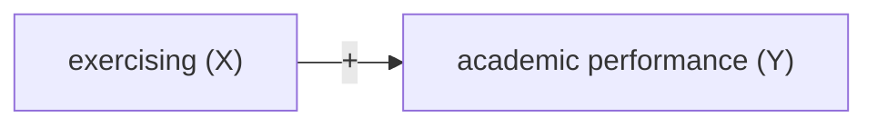
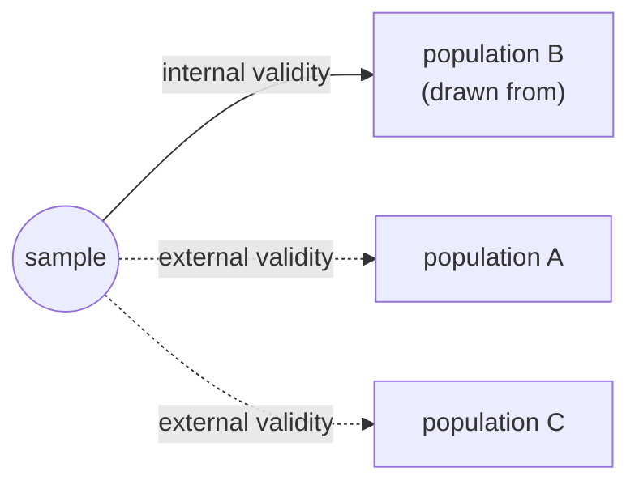

# Lecture 3: Sampling

**Date:** 01 Oct 2026 (online) · **Lecturer:** Lukas Schmid · [Exercises](exercises.md)

## Contents

1. [Motivation](#1-motivation)
2. [Principles of sampling](#2-principles-of-sampling)
3. [Sampling techniques](#3-sampling-techniques)
4. [Internal and external validity](#4-internal-and-external-validity)
5. [Case study: US presidential election 1936](#5-case-study-us-presidential-election-1936)
6. [Key terms](#key-terms)

The slides give the definitions. The study examples in sections 3 and 4 (Oregon, Strukturerhebung, HBSC, PISA, Gallup 1948, WEIRD, California) are my additions, sources at the end.

---

## 1. Motivation

**Example 3.1:** Does exercising increase individuals' academic performance?

- **Population of interest:** all students.
- We can never observe all students. We observe a **sample** and want to conclude something about the population.
- Two questions follow, and the lecture is built around them:
  1. Who ends up in the sample, and does the sample look like the population? → sampling
  2. Does a result from the sample hold for the population, and for other populations? → internal and external validity

## 2. Principles of sampling

### 2.1 Anecdotal evidence

> "My sister does not do any exercise and always gets top grades."
> "My uncle smokes three packs of cigarettes a day and is in excellent health."

**Definition 3.1:** Anecdotal evidence is based on a very limited sample that is not representative of the entire population.

- One case says nothing about the average. The uncle may be one of the smokers who are lucky, and we never hear from the ones who died.
- Anecdotes are also selected: we remember and retell the surprising cases.

**Example 3.2: Anti-smoking research.** Cigarettes were advertised as healthy in the early 20th century ("More doctors smoke Camels than any other cigarette"). Research on the harm of smoking started in the 1930s and 1940s and met resistance based on anecdotes ("some smokers are completely unaffected"). Only larger samples of smokers made the negative health effects clear. The effect is real, but it is an average effect. Individual smokers vary a lot, which is exactly why single cases mislead.

### 2.2 Surveying the entire population (census)

Why not ask everyone? Three problems:

1. Some individuals are hard to find, and they tend to **differ** from the rest. Missing them biases the census.
2. The population changes continuously (births, deaths, migration).
3. A census is far more complex and expensive than a sample.

**Example 3.3: Undercount of immigrants in the US census 2020.** The Census Bureau estimated that the 2020 census may have missed a substantial share of non-citizens, especially those with "unknown legal status". About 19.7% of non-citizens found in administrative records had addresses that could not be matched with the census.

- Even a census is a sample in practice, with nonresponse that is not random.
- Switzerland stopped the classical full census after 2000. Since 2010 the Federal Statistical Office (BFS) combines population registers with yearly sample surveys such as the **Strukturerhebung** (section 3.2).

### 2.3 Sampling

**Soup analogy:** you taste one spoonful before serving the whole pot. If the soup is well stirred, one spoon tells you how the pot tastes.

- The sample must be **representative** of the population.
- Drawing a conclusion from the sample to the population is called **inference**.
- Stirring the soup is what random sampling does. Every part of the pot has the same chance to land in the spoon.

### 2.4 Sampling bias

Non-representative samples lead to biased estimators. This is **sampling bias** (also selection bias).

Example on the slides: we want to learn about all students but only sample students from the IDS master programme. Whatever makes these students special (age, programme, motivation) ends up in the estimate.

Even with random selection, three things can still bias a sample:

| Problem                   | What happens                                                                   | Example (my addition)                                                                                                                                                                                                                                                                  |
| ------------------------- | ------------------------------------------------------------------------------ | -------------------------------------------------------------------------------------------------------------------------------------------------------------------------------------------------------------------------------------------------------------------------------------- |
| **Nonresponse**           | only a small share of the selected people answers, and they differ from the rest | Literary Digest 1936: only 24% sent the ballot back, and Landon voters were more likely to answer (section 5)                                                                                                                                                                          |
| **Voluntary participation** | people decide themselves to take part, usually because they care about the topic | Ann Landers (1976) asked her readers: "If you had it to do over again, would you have children?" About 70% of the 10,000+ respondents said no. A random sample of 1,373 parents (Newsday) found 91% would. Unhappy parents had a reason to write in. |
| **Convenience sample**    | easily accessible people are more likely to be included                         | Psychology experiments with US undergraduates (WEIRD samples, section 4.3)                                                                                                                                                                                                             |

In all three cases the **population actually sampled** is smaller than the **population of interest**, and the gap is not random.

### 2.5 Bias and variance (my addition)

The slides talk about bias. Two different things can go wrong with an estimate, and it helps to keep them apart:

| | Meaning | Soup | Fix |
| --- | --- | --- | --- |
| **Bias** | the estimator is wrong on average, even over many samples | you always take the spoon from the top layer | a better sampling design, not a larger sample |
| **Variance** | the estimate jumps around from sample to sample | the spoon is very small | a larger sample |

- A huge biased sample is worse than a small random one. The Literary Digest had 2.4 million answers and missed by about 20 percentage points. Gallup had about 50,000 and got the winner right (section 5).
- For a share p estimated from a simple random sample of size n, the standard error is √(p(1−p)/n). With p = 0.6 and n = 1,000 this is about 0.015, so estimates between roughly 0.57 and 0.63 are normal sampling noise. This matters in Exercise 3.2.

### 2.6 Estimator and estimate

**Definition 3.2:**

- **Estimator:** a formula or rule, based on sample data, used to estimate an unknown population parameter.
- **Estimate:** the number you get when you apply the estimator to one particular sample.

| Estimator (the rule) | Estimate (one value) |
| --- | --- |
| sample mean x̄ = (1/n) Σ xᵢ | average age in IDS: x̄ = 31.5 |
| OLS slope β̂₁ = Σ(xᵢ − x̄)(yᵢ − ȳ) / Σ(xᵢ − x̄)² | relationship between exercise and grades: β̂₁ = 0.3 |

- The estimator is a random variable: a new sample gives a new estimate. Bias and variance (2.5) are properties of the **estimator**, not of a single estimate.
- The population value is the **parameter** (often written μ or β₁). It is fixed but unknown.
- The slide writes the β̂₁ sums from 1 to N. For a sample it should be n.

## 3. Sampling techniques

### Overview

| Technique | How it is drawn | Probability sample? | Unbiased? | Main reason to use it |
| --- | --- | --- | --- | --- |
| Simple random | every unit has the same chance, independent of the others | yes | yes | simple, the benchmark |
| Stratified | split into homogeneous strata, simple random sample in **each** stratum | yes | yes (with weights if shares differ) | more precise, guarantees subgroups |
| Cluster | random sample of clusters, **all** units in the chosen clusters | yes | yes, if clusters are representative | cheap, no list of individuals needed |
| Multistage | random sample of clusters, then random sample of units inside | yes | yes, if clusters are representative | cheap, large populations |
| Quota | fill fixed shares of subgroups, people inside a quota chosen freely | **no** | not guaranteed | fast and cheap, no list needed |

Strata and clusters look alike in the pictures, but the logic is the opposite:

| | Stratum | Cluster |
| --- | --- | --- |
| Inside | similar units (homogeneous) | mixed units (heterogeneous), ideally a small copy of the population |
| Between | groups differ from each other | groups are alike |
| Sampled | **every** stratum, some units in each | **some** clusters, all (or some) units in each |
| Effect on precision | better than simple random | worse than simple random (units in a cluster tend to be similar) |

### How to read the examples

For each technique I show how the study draws its sample and what it means for validity, using the lecture's definitions (section 4):

- **Internal validity:** does the result hold for the population the sample was drawn from?
- **External validity:** does it carry over to other populations or settings?

### 3.1 Simple random sample

**How:** randomly select cases from the population with no connection between the selected units. Every unit has the same chance. You need a complete list of the population (the **sampling frame**).

**Example: Oregon Health Insurance Experiment (2008).** Oregon had money for about 10,000 additional places in its Medicaid programme for low-income adults. About 90,000 people signed up on a waiting list. Between March and September 2008 the state drew about 30,000 names from the list **by lottery**. Those drawn could apply for Medicaid, the others could not.

| | |
| --- | --- |
| Population (frame) | the ~90,000 people on the waiting list |
| Sampling | lottery = simple random sample of names |
| Internal validity | high. Winners and losers of the lottery differ only by chance. A difference in health, doctor visits or debt between the two groups is the effect of getting access to Medicaid, **for people on this waiting list**. |
| External validity | limited. Everyone on the list volunteered, so they likely needed or wanted insurance more than the average low-income adult. Oregon in 2008, with its health system and prices, is one setting. Whether the result holds for a nationwide Medicaid expansion or for Switzerland is a separate question. |

- The lottery does two jobs at once: it **samples** (who is selected) and **assigns** (who gets access). This is why the study is famous. Random assignment is the topic from lecture 5 onwards.
- Exercise 3.2 part 2 is a simple random sample: each of the 100,000 people enters with probability 1%.

### 3.2 Stratified sample

**How:** split the population into **strata** of similar units (for example cantons, gender, car owners vs. non-owners). Draw a simple random sample from **each** stratum.

- **Proportional:** each stratum gets the same sampling rate. The sample reproduces the population shares exactly.
- **Disproportionate:** small strata get a higher rate so that there are enough cases to say something about them. Then each person must be weighted by 1 / (their selection probability) when estimating the overall mean, otherwise the small strata count too much.

**Example: BFS Strukturerhebung (Swiss structural survey).** Part of the Swiss census since 2010. Every year about 200,000 people (aged 15+, living in private households) are drawn from the population registers and get a written questionnaire on language, religion, education, commuting and more. The sample is drawn per canton, and cantons and cities can buy a larger sample. The city of Bern, for example, surveyed about 14,000 people in 2010.

| | |
| --- | --- |
| Strata | cantons (and cities that enlarged their sample) |
| Why stratify | every canton gets enough cases for its own results. A simple random sample of 200,000 would give Appenzell Innerrhoden only about 400 people. |
| Internal validity | high for the population covered (permanent residents 15+ in private households), **if the weights are used**. Without weights, Bern residents count too much in a Swiss average. Nonresponse remains a risk, as in any survey. |
| External validity | nothing about people in care homes, prisons or student halls (collective households), children under 15, or other countries. A 2026 result about commuting also need not hold in 2035 (different conditions). |

- Stratification **cannot hurt** and helps more the more the strata differ in the outcome. In Exercise 3.2 support is 72% among people without a car and 47% among car owners, so stratifying by car makes the estimate a bit more precise than a simple random sample of the same size.
- Do not confuse with stratified **randomization** (lecture 11), where the strata are used to assign treatments.

### 3.3 Cluster sample

**How:** the population consists of natural groups (**clusters**: classes, schools, municipalities, households). Take a simple random sample of clusters and include **all** units in the selected clusters.

- Cheaper: one visit to a class gives 20 questionnaires. Often there is no list of all individuals, but there is a list of clusters.
- Unbiased if the clusters are representative of the population.
- Less precise than a simple random sample of the same size: pupils in the same class share a teacher, peers and a neighbourhood, so the 20th pupil adds less new information than a random pupil from elsewhere. The more similar units within a cluster are, the bigger the loss.

**Example: HBSC Switzerland (Health Behaviour in School-aged Children).** Every four years, Sucht Schweiz surveys 11- to 15-year-olds in Swiss schools (grades 5 to 9) about health, smoking, alcohol and well-being. School **classes** are drawn at random (stratified by canton and school level), and **all pupils in a selected class** fill in the questionnaire in the classroom. In 2022: 9,345 pupils in 636 classes.

| | |
| --- | --- |
| Clusters | school classes |
| Why clusters | there is no national list of all pupils, but schools can list their classes. One class visit gives a whole set of answers. |
| Internal validity | high for pupils in Swiss schools in grades 5 to 9 who were **present on the survey day**. Pupils who skip school might smoke more and are missing. Standard errors must account for the clustering, otherwise they are too small. |
| External validity | not automatically for children outside regular schools, or for other countries. Because more than 50 countries run HBSC with the same protocol, the comparison across countries is better than for most surveys, but conditions (laws on tobacco, school system) differ. |

- HBSC is strictly a **stratified cluster sample**. Real surveys often combine techniques.
- Exercise 3.2 part 4 uses municipalities as clusters.

### 3.4 Multistage sample

**How:** take a simple random sample of clusters, then a simple random sample of units **within** the selected clusters. Two (or more) stages.

- Same logic as cluster sampling, but you do not need to interview everyone in a cluster. Spreading the sample over more clusters gives better precision for the same cost.
- Unbiased if the clusters are representative.

**Example: PISA (OECD Programme for International Student Assessment).** Tests 15-year-olds in reading, mathematics and science every three to four years.

- **Stage 1:** at least 150 schools per country, stratified (for example by region and school type) and drawn with probability proportional to the number of 15-year-olds in the school. Large schools are more likely to be selected.
- **Stage 2:** inside each selected school, 42 fifteen-year-olds are drawn at random (all of them if there are fewer than 42).
- Result: about 5,000 to 6,000 tested students per country.

| | |
| --- | --- |
| Stage 1 / Stage 2 units | schools / students |
| Why two stages | testing in 150 schools is affordable, testing a random 6,000 students spread over the whole country is not. Sampling inside the school avoids testing hundreds of students in large schools. |
| Internal validity | high for 15-year-olds **enrolled in school** (grade 7 or higher) in that country, with weights. Big schools are more likely in stage 1 but contribute only 42 students, so every student ends up with a similar chance. |
| External validity | the target population itself differs between countries. Where many 15-year-olds have left school, PISA covers a selected, stronger group. A ranking then compares different populations (lecture: "different populations"). Statements like "country X does better because of policy Y" go beyond what the sample can show. |

- Exercise 3.1 d is a two-stage sample: five classes, then a random sample of students in those classes.

### 3.5 Quota sampling

**How:** split the population into subgroups (gender, age, region, …) and fill the sample so that each subgroup has the same share as in the population. **Inside** each quota, interviewers choose whom to ask.

The caveat on the slide is the key point: the sample matches the population on the **observable** quota variables, but not necessarily on **unobservable** ones. Inside a quota, the choice is not random.

**Example: Gallup and the US presidential election 1948.** Gallup used quota sampling. Interviewers received quotas (for example a number of men over 40 in a given city, split by economic status) and were free to choose the people within them.

| | Dewey (Republican) | Truman (Democrat) |
| --- | --- | --- |
| Gallup final poll (October) | 49.5% | 44.5% |
| Actual result | 45.1% | 49.6% |

| | |
| --- | --- |
| What went wrong | within each quota, interviewers tended to pick people who were easier to approach: better dressed, better housed, more educated. Those leaned Republican. The quotas were met, the political mix was not. Gallup also stopped polling in mid-October and missed late shifts towards Truman. |
| Internal validity | low. Even for the population of US voters in 1948, the estimate was biased. No guarantee exists that the hidden selection inside quotas is harmless. |
| External validity | the question does not arise if the result is not valid for its own population. |

- After 1948 US pollsters moved towards probability sampling.
- Quota sampling is still common in market research and online panels because it is fast and cheap. The caveat stays the same.

### 3.6 Which technique when?

| Situation | Good choice |
| --- | --- |
| complete list of individuals, no budget issue | simple random |
| list available and you know a variable that predicts the outcome, or you need results for subgroups | stratified |
| no list of individuals, but a list of groups, and visiting a group is cheap | cluster |
| large, spread-out population (country) | multistage, usually combined with stratification |
| quick, cheap, rough picture, accepting unknown bias | quota |

## 4. Internal and external validity

### 4.1 Definitions

**Definition 3.3:**

- **Internal validity:** an estimator is internally valid if the estimated causal effect from the sample can be generalized to the population.
- **External validity:** an estimator is externally valid if the estimated causal effect from the sample can also be generalized to other populations and settings.

The slide's picture, redrawn: the sample was drawn from population B.

**A note on the definition.** In much of the literature (Campbell, Shadish, Cook), internal validity means "is the effect in the study really causal, or is it a confounder, reverse causality, …?" The lecture's definition also includes the step from sample to population. Both parts are needed for a valid causal statement about population B:

| | Random assignment of X | No random assignment of X |
| --- | --- | --- |
| **Random sampling** | causal effect for the population | association for the population, causal claim doubtful |
| **No random sampling** | causal effect for the people in the study | association for the people in the study only |

(Table adapted from Ramsey and Schafer, _The Statistical Sleuth_.) This lecture is about the rows (sampling). Lecture 4 covers the threats to the causal part, lectures 5 onwards the columns (random assignment).

### 4.2 Assessing external validity

Two questions:

1. **Different populations:** are the people in the target population different from those studied (age, income, culture, motivation)?
2. **Different conditions:** are the circumstances different (institutions, laws, prices, physical environment, scale)?

### 4.3 Examples

**Exercise and academic performance (Cappelen et al. 2026, lecture 2).** Students at the University of Bergen were randomly offered a free gym membership. Those offered exercised more and completed more courses.

| | |
| --- | --- |
| Internal validity | high for the students in the study. The lottery makes the groups comparable (random assignment). Generalizing to all Bergen students depends on who signed up for the study. |
| External, different population | HSLU part-time master students who work alongside the studies have much less free time. Would a gym membership have the same effect on them? Unknown. |
| External, different conditions | the treatment was a **free** membership in Norway. In a setting where students already exercise a lot, or where gyms are far from campus, the offer may change little. |

**WEIRD samples (Henrich, Heine and Norenzayan 2010), different populations.** In top psychology journals, 96% of subjects came from Western industrialized countries, which hold about 12% of the world population, and 68% from the US alone. Many samples were undergraduate students (convenience samples). Results thought to be universal turned out not to be. In the Müller-Lyer illusion (two equal lines with arrow ends that look different in length), American undergraduates showed the strongest illusion of 16 societies, while San foragers from the Kalahari showed almost none. Internal validity of each experiment can be fine. External validity to "humans" was assumed, not shown.

**Class size: Tennessee STAR vs. California, different conditions.** The Tennessee STAR experiment (late 1980s) randomly assigned pupils to small or regular classes and found clear gains from small classes. California then reduced class sizes in kindergarten to grade 3 statewide from 1996, from about 29 to about 19 pupils. Effects were much smaller. Reducing all classes at once required thousands of new teachers. By 1997–98 nearly a quarter of California's teachers had one year of experience or less, concentrated in poor schools. The experiment was internally valid. Scaling it up changed the conditions (teacher supply), so the result did not transfer one to one.

**Oregon (section 3.1), both.** Valid for people who signed up for the waiting list in Oregon in 2008. Different population: people who would not have signed up. Different conditions: another health system.

### 4.4 Checklist

| Question | Threat to |
| --- | --- |
| Was the sample drawn at random from the population I talk about? | internal (sampling) |
| Who did not respond or dropped out, and are they different? | internal (sampling) |
| Is the effect causal, or could a third variable explain it? | internal (lecture 4) |
| Is my target population similar to the studied one? | external |
| Are institutions, laws, prices and scale similar? | external |

## 5. Case study: US presidential election 1936

**Example 3.4:** Alf Landon (Republican) against Franklin D. Roosevelt (Democrat). The Literary Digest polled its own readers, registered car owners and registered telephone owners. About 10 million people were contacted, 2.4 million responded. Forecast: Roosevelt 43%. Actual: Roosevelt about 62%.

**What went wrong:** two of the biases from section 2.4 at once.

| Source | Mechanism |
| --- | --- |
| Sampling frame | In 1936, during the Great Depression, owning a car or a telephone or subscribing to a magazine was a sign of wealth. Wealthier voters leaned towards Landon. The frame was not the population. |
| Nonresponse | Only 24% sent the ballot back. Squire (1988) used a 1937 Gallup survey and found that Landon supporters were more likely to return the ballot. If everyone contacted had answered, the Digest would at least have predicted the right winner. |

The slide graph shows this with 1,000 fictitious people: the population mean of support is 0.62, but the people in the sample are mostly drawn from the Landon side, so the sample mean is 0.43.

- **Size does not fix bias.** 2.4 million answers, still about 20 percentage points off. George Gallup, with about 50,000 people chosen to reflect the population, predicted a Roosevelt win (55.7%).
- **Numbers:** Roosevelt got 60.8% of the popular vote and 62.5% of the votes cast for the two main candidates. The slide's 62% is the two-party share. The Digest forecast Landon at 57%.
- The Literary Digest went out of business soon afterwards.
- Exercise 3.2 part 3 repeats this mistake on purpose: a sample of car drivers estimates support for a climate referendum.

---

## Key terms

| Term | Meaning |
| --- | --- |
| Population | all units we want to learn about |
| Sample | the units we actually observe |
| Sampling frame | the list from which the sample is drawn |
| Census | an attempt to observe the whole population |
| Anecdotal evidence | conclusions from very few, non-representative cases |
| Representative sample | a sample that looks like the population in all relevant respects |
| Inference | conclusion from the sample to the population |
| Sampling bias (selection bias) | systematic difference between sample and population caused by how the sample was drawn |
| Nonresponse bias | selected people who answer differ from those who do not |
| Voluntary response | participants select themselves |
| Convenience sample | easily reachable units are over-represented |
| Estimator | rule to compute an estimate from sample data, e.g. x̄ |
| Estimate | the value of the estimator in one sample, e.g. x̄ = 31.5 |
| Bias | estimator is wrong on average |
| Variance / standard error | how much the estimate varies from sample to sample |
| Simple random sample | every unit has the same chance, independently |
| Stratified sample | simple random sample within each of several homogeneous groups |
| Cluster sample | random clusters, all units within them |
| Multistage sample | random clusters, then random units within them |
| Quota sample | fixed shares per subgroup, non-random choice within |
| Internal validity | result holds for the population the sample comes from |
| External validity | result holds for other populations and settings |

## References

From the slides:

- Çetinkaya-Rundel, M., Diez, D. and Barr, C. (2019). _OpenIntro Statistics_. Fourth edition. OpenIntro.

My additions:

- Baicker, K. et al. (2013). The Oregon Experiment — Effects of Medicaid on Clinical Outcomes. _New England Journal of Medicine_ 368: 1713–1722. Background: [NBER, Oregon Health Insurance Experiment](https://www.nber.org/programs-projects/projects-and-centers/oregon-health-insurance-experiment/oregon-health-insurance-experiment-background)
- Finkelstein, A. et al. (2012). The Oregon Health Insurance Experiment: Evidence from the First Year. _Quarterly Journal of Economics_ 127(3): 1057–1106.
- Bundesamt für Statistik: Strukturerhebung. Sample size and enlargement by cities: [Stadt Bern, Strukturerhebung](https://www.bern.ch/politik-und-verwaltung/stadtverwaltung/prd/abteilung-aussenbeziehungen-und-statistik/statistik-stadt-bern/volkszahlung-2010/strukturerhebung)
- Sucht Schweiz: [Die HBSC-Studie in der Schweiz](https://www.hbsc.ch/de/studie_in_kurze.html)
- NCES: [PISA 2015, international sampling requirements](https://nces.ed.gov/surveys/pisa/pisa2015/pisa2015highlights_8a.asp)
- Gallup 1948 numbers: [1948 United States presidential election](https://en.wikipedia.org/wiki/1948_United_States_presidential_election)
- Henrich, J., Heine, S. J. and Norenzayan, A. (2010). The weirdest people in the world? _Behavioral and Brain Sciences_ 33(2–3): 61–83.
- Jepsen, C. and Rivkin, S. (2002). [Class Size Reduction, Teacher Quality, and Academic Achievement in California Public Elementary Schools](https://www.ppic.org/wp-content/uploads/content/pubs/report/R_602CJR.pdf). Public Policy Institute of California.
- Landers, A. (1976) and the Newsday comparison poll, as reported in [UMBC teaching notes](https://userpages.umbc.edu/~nmiller/POLI300/stat353annlanders.pdf)
- Ramsey, F. and Schafer, D. _The Statistical Sleuth_. Chapter 1 (statistical inference and study design).
- Squire, P. (1988). Why the 1936 Literary Digest Poll Failed. _Public Opinion Quarterly_ 52(1): 125–133.
- [The Literary Digest](https://en.wikipedia.org/wiki/The_Literary_Digest) (circulation, Gallup 1936 forecast)
