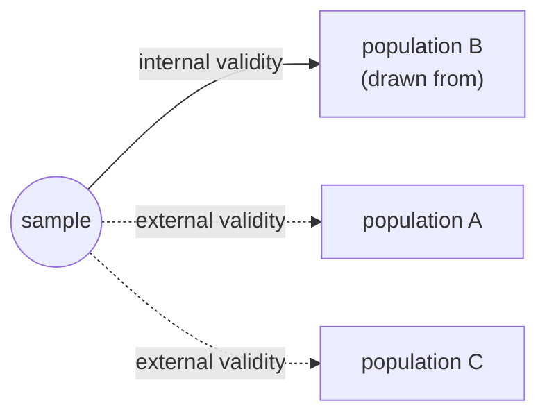
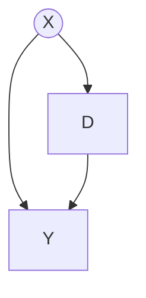
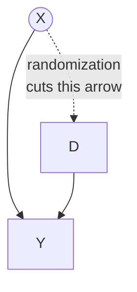
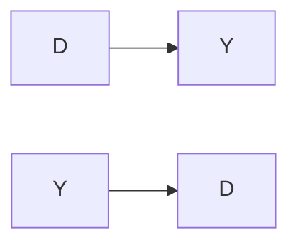

# Lecture 4: Threats to internal validity

**Date:** 08 Oct 2026 (onsite) · **Lecturer:** Lukas Schmid · [Exercises](exercises.md)

## Contents

1. [Motivation](#1-motivation)
2. [Classical threats](#2-classical-threats)
3. [Implementation threats](#3-implementation-threats)
4. [Application: beta-carotene and lung cancer](#4-application-beta-carotene-and-lung-cancer)
5. [Overview of all threats](#5-overview-of-all-threats)
6. [Key terms](#key-terms)

The slides give the definitions and the examples 4.1 to 4.9. The study examples inside the sections (Messerli, ATBC and CARET, Levitt and List on Hawthorne, Miguel and Kremer, Hróbjartsson and Gøtzsche) and the attenuation formula are my additions, sources at the end.

---

## 1. Motivation

Repetition from lecture 3 (definition 3.3):

- **Internal validity:** the estimated causal effect from the sample can be generalized to the population it was drawn from.
- **External validity:** the estimated causal effect can also be generalized to other populations and settings.

Lecture 3 was about the step from sample to population (who gets sampled). This lecture is about the other half of internal validity: **is the estimated effect causal at all**, even within the sample. The lecture splits the threats in two:

| Group | When it strikes | Threats |
| --- | --- | --- |
| **Classical** | the data-generating process, before you touch anything | confounders, reverse causality, functional form, measurement error |
| **Implementation** | while you run a study on humans who notice | placebo, non-compliance, attrition, spillovers, Hawthorne, John Henry |

The classical threats apply to any analysis, observational or experimental. The implementation threats are what can still go wrong **after** randomization, which is why they come back in lectures 5 to 11.

## 2. Classical threats

### 2.1 Confounders

**Definition.** A confounder is a variable X that has a causal impact on both D and Y.

Neglecting the confounder makes the observed relationship between D and Y **spurious**: it looks real but is caused by a hidden factor.

> The slide writes "a confounder is a variable D that has a causal impact on both D and Y". From the graph, the first letter should be X. The table on the next slide then calls the confounder Z and the regressor X. Same thing, three names: **the confounder sits upstream of both the treatment and the outcome**.

#### Example 4.1: Chocolate consumption and Nobel prize winners

Messerli (2012) plotted chocolate consumption per capita against Nobel laureates per capita for 23 countries and found a correlation of about 0.79. Switzerland leads on both axes.

The obvious confounder is **national wealth** (GDP per capita): rich countries eat more chocolate and also fund the universities that produce Nobel laureates.

Two further problems with this picture, worth knowing:

- **Ecological fallacy.** The data are country averages. Nothing says the individuals who eat the chocolate are the ones who win the prizes.
- **Outcome timing.** Nobel laureates are counted today, chocolate consumption is measured today, but the research was done decades earlier.

#### Direction of the bias

Whether the estimate is too big or too small depends on the two correlations of the confounder:

| | **Cor(Z, X) positive** | **Cor(Z, X) negative** |
| --- | --- | --- |
| **Cor(Z, Y) positive** | upward bias | downward bias |
| **Cor(Z, Y) negative** | downward bias | upward bias |

- **Upward bias:** the estimate is bigger than the true parameter, β₁ < β̂₁
- **Downward bias:** the estimate is smaller than the true parameter, β̂₁ < β₁

The rule in one line: **the bias has the sign of the product of the two correlations**. Same signs push the estimate up, opposite signs push it down.

The formal version (omitted variable bias) is useful for the exam and is exactly what exercise 4.2 shows:

> β̂ from the short regression = β (true) + γ · δ
> where γ is the effect of the confounder on Y, and δ is the slope of the confounder regressed on the treatment.

Two things follow:

- **Upward does not mean "too positive".** If the true effect is −5 and the estimate is −2, that is an upward bias. The slides' four pictures per direction make the same point: the lines can be shifted, rotated or flipped and still be the same direction of bias.
- **A big bias needs both links to be strong.** A confounder that barely moves Y, or that is barely related to D, does almost nothing.

#### Example 4.2: Direction of bias

| Relationship | Confounder? | Cor(Z, X) | Cor(Z, Y) | Direction |
| --- | --- | --- | --- | --- |
| Having a lighter and lung cancer | **smoking** | positive (smokers carry lighters) | positive (smoking causes lung cancer) | **upward**. Lighters have no effect at all, so the whole observed relationship is the bias. |
| Winning the lottery and happiness | among **ticket buyers**, no: the draw is random. Comparing winners against the general population, yes: who plays at all is related to income, age and education | depends on the comparison | depends | undefined. This is the example of a relationship that **can** be clean, which is why lottery studies are used as natural experiments. |
| Ice creams sold and people drowning | **temperature / summer** | positive (hot days sell ice cream) | positive (hot days bring people into the water) | **upward**. Again the true effect is zero. |

#### Solutions

1. Hold the confounders constant in a regression model (statistics lecture)
2. Conduct an experiment
3. Look at natural experiments

The catch with solution 1: it only works for confounders you can **measure**. Motivation, ability and family background usually cannot be measured well, which is why solutions 2 and 3 exist. Randomization deals with all confounders at once, measured or not, because it breaks the arrow from X into D.

### 2.2 Reverse causality

**Definition.** Reverse causality is a situation in which D might have a causal effect on Y, but Y also definitely has a causal effect on D.

#### Example 4.3: Drug use and mental health

Researchers notice that people who use drugs report lower mental well-being, and conclude that drug use causes poor mental health. The arrow may point the other way: people who already struggle are more likely to turn to drugs.

#### Example 4.4: Reverse causality

| Relationship | Reverse causality? |
| --- | --- |
| Interest rates on inflation | **Yes, and it is the main problem.** Central banks raise rates *because* inflation rises. A naive regression of inflation on interest rates can even produce a positive coefficient, the opposite of the intended effect. This is simultaneity: both variables are determined at the same time. |
| Income on happiness | **Yes, in both directions.** More income may raise happiness, and happier people are more productive, more employable and more likely to be promoted. A confounder (health, personality, family background) sits on top of it. |

#### Solutions

1. Apply structural models (vector autoregression models)
2. Conduct an experiment
3. Look at natural experiments

A VAR uses the time dimension: today's inflation is explained by past interest rates and vice versa. The usual warning applies, **Granger causality is prediction, not causation**. If people anticipate the rate hike, the effect shows up before the cause.

The clean trick in practice is to find a part of the variation in D that cannot be caused by Y, for example a rate change forced by an exchange rate peg rather than by domestic inflation.

### 2.3 Misspecification of the functional form

**Definition.** Misspecification is when the functional form of the estimated regression differs from the functional form of the population regression. This leads to biased estimators.

The slide's picture: the true relationship rises and then flattens off, the fitted straight line cuts through it. The line is too low at the start, too high in the middle, too low again at the end.

**Solution.** Look at the bivariate relationship between X (or D) and Y and choose a suitable functional form. This may mean polynomials of X (X², X³) or transformations of X and/or Y (logarithms, sine).

Points worth noting:

- **Always plot before you regress.** The scatter plot in exercise 4.2 is exactly this step, and it is why the exercise asks for the slope guess before the regression.
- **A linear fit of a curved relationship is not useless, it is a local average.** The reported slope is an average over the range of X in the data. The damage is done when it is extrapolated.
- **Logarithms change the interpretation**, not just the fit: log(Y) on X means a percentage change in Y per unit of X, log(Y) on log(X) is an elasticity.
- More flexibility is not free. A high-order polynomial fits the noise and behaves badly at the edges of the data.

### 2.4 Measurement error

Bias due to measurement error arises when the dependent or an independent variable is measured imprecisely. The consequence depends on **which** variable is mismeasured, and the two cases are completely different.

#### 4a. Measurement error in the independent variable (X)

If the measurement error is uncorrelated with the independent variable, it leads to **attenuation bias**: the estimated coefficient is biased **towards zero**.

The slide shows β̂₁ = 3.0 without error, 1.48 with a small error and 0.55 with a large one.

The size of the attenuation is known in advance:

> plim β̂₁ = β₁ · σ²ₓ / (σ²ₓ + σ²ᵤ)

where σ²ᵤ is the variance of the measurement error. The factor is the share of the observed variation that is real. With a noise variance equal to the signal variance, you lose exactly half the coefficient. The notebook reproduces this to three decimals.

- The bias is **towards zero**, never past it. The sign stays right, the magnitude shrinks.
- It does not disappear with a larger sample. More data gives a more precise estimate of the wrong number.
- This is the standard argument why survey-based variables (self-reported income, hours worked, "motivation" scores) understate effects.
- The assumption matters: the error must be **unrelated** to the true value (classical measurement error). If people with high incomes understate them more, the error is correlated with X and the bias can go either way.

#### 4b. Measurement error in the dependent variable (Y)

Measurement error in the dependent variable leads to an **increase in the standard error**, a loss of precision.

The slide shows β̂₁ = 3.0 (0.011), 2.99 (0.034) and 2.86 (0.065). The point estimate stays, the standard error multiplies by six.

The reason: noise in Y just enlarges the residual, which is already assumed to be there. The estimator remains unbiased, it only becomes noisier.

| | Error in **X** | Error in **Y** |
| --- | --- | --- |
| Point estimate | biased towards zero | unbiased |
| Standard error | changes, but the number it surrounds is wrong | larger |
| Fixed by more data? | no | yes |
| In the bias/variance language of lecture 3 | **bias** | **variance** |

## 3. Implementation threats

These are the threats that appear once real people know they are in a study. All six have one thing in common: the problem is not in nature, it is in the **execution**.

### 3.1 Placebo effect

**Definition.** The placebo effect occurs when an intervention that mimics the actual treatment but contains no effective medication causes improvement in a patient's condition, because of factors associated with the patient's perception of the intervention.

Treated patients react to **both** the medication and the perception, so the real treatment effect is **overestimated**.

**Solution.** Give individuals in the control group something that looks exactly like the treatment.

- This is why trials are **blind** (the patient does not know) and better still **double blind** (the person handing out the pill does not know either, so they cannot signal it).
- Part of what is called a placebo effect is not an effect at all: people enter a trial when they feel at their worst, and improve anyway (regression to the mean, natural course of the illness). Hróbjartsson and Gøtzsche (2001) compared placebo groups with untreated groups across 114 trials and found little effect except for subjectively reported outcomes such as pain.
- The equivalent outside medicine is any treatment where receiving attention is itself part of the package, for example a training programme. The control group should get an equally time-consuming but ineffective activity.

### 3.2 Non-compliance

**Definition.** Non-compliance means that the subjects do not comply with the treatment protocol. Two directions:

- treated individuals do not get the treatment
- control individuals do get the treatment

**Solution.** You can always estimate the **intention-to-treat** effect, but not the effect of the treatment itself. For the treatment effect you need instrumental variable methods (course "Natural Experiments Using R").

| Estimand | What it compares | Why it survives non-compliance |
| --- | --- | --- |
| **ITT** (intention to treat) | everyone assigned to treatment vs. everyone assigned to control, no matter what they did | the assignment is still random, so the comparison is still clean |
| **ATE / LATE** | people who actually took the treatment | taking it is a **choice**, and the choosers differ from the non-choosers |

- Dropping the non-compliers and comparing the rest destroys the randomization. This is the single most common mistake with a broken trial.
- The ITT is not a second-best consolation prize. For a policy question it is often the right number: a vaccination campaign is judged by what happens when it is offered, not by what happens to those who show up.
- With one-sided non-compliance, ITT = effect × share who complied, so the ITT is smaller in absolute terms than the effect on the compliers.

### 3.3 Attrition

**Definition.** Attrition means that the sample systematically changes, so the causal impact cannot be recovered because data are lacking.

#### Example 4.5: Attrition

A company studies the impact of better internal education on happiness. Because of the education, some employees leave the company, and these are the ones with the highest happiness. Comparing the remaining treated with the controls misses the happiest employees and gives a biased result.

**Solution.** Principal stratification (Frangakis and Rubin 2002).

- Attrition is **selective dropout**. Random dropout only costs sample size, which is a precision problem, not a bias problem.
- The warning sign is attrition that **differs between the groups**, in rate or in composition. Report both, and compare the baseline characteristics of those who stayed.
- A model-free alternative to principal stratification is bounding (Lee bounds): assume the worst and the best about the missing people and report the interval.
- Example 4.5 is attrition caused *by* the treatment, which is the nasty case: the treatment changed who you can observe.

### 3.4 Spillover effects

**Definition.** Spillover effects are present if treating individual i also has an impact on individual i+1 in the control group. The absolute impact of the treatment is typically **underestimated**, because the outcomes of treated and control units are more similar than they would be without spillovers.

#### Example 4.6: Spillover effects

A researcher studies the effect of a new protein bar on academic performance. If students talk about the bar, control students are more likely to get one too, and a real positive effect is less likely to be detected.

**Solution.** Estimate peer effects regressions.

- This is a violation of **SUTVA** (lecture 5): my outcome must not depend on your treatment status.
- The usual practical fix is to **randomize at the level at which people interact**: schools, villages, firms, regions instead of individuals. The price is fewer independent units and therefore less power.
- The sign is not always negative. Treating some pupils in a class can *hurt* the untreated ones (competition for a teacher's attention), which **overstates** the effect.
- Miguel and Kremer (2004) treated whole schools against worms in Kenya. Untreated children in nearby schools also became healthier, because there were fewer worms around. An individual-level study would have missed most of the benefit.

### 3.5 Hawthorne effect

**Definition.** The Hawthorne effect describes a reaction in treated individuals' behaviour caused by their awareness of being observed.

#### Example 4.7: Hawthorne effect

At the Hawthorne Works factory in the 1920s, a study tested whether brightness of lighting made workers more productive. Productivity appeared to rise whenever the lighting was changed, and dropped back once the study ended. The driver was not the lighting, it was the attention.

**Solution.** Researchers should not state directly which treatment conditions they are interested in.

- Levitt and List (2011) dug out the original illumination data and found the effect far weaker than the story suggests. Productivity rose whenever the experimenters appeared, which was typically a Monday, and the original comparison ignored the weekly pattern. The term is more solid than its founding study.
- Practical versions: unobtrusive measurement (administrative data instead of a questionnaire), a long enough study for the novelty to wear off, and giving the control group the same amount of attention.
- It differs from the placebo effect in what people react to: the **medication** they think they got (placebo) versus **being watched** (Hawthorne).

### 3.6 John Henry effect

**Definition.** The John Henry effect arises when members of the control group realize that they are not receiving the treatment. If they work harder to compensate for the perceived disadvantage, their extra effort biases the results.

#### Example 4.8: John Henry effect

John Henry was a legendary American steel driver from the 1870s who, on learning that his work was being compared with a steam drill, pushed himself so hard to beat the machine that he died from the effort.

- The control group gets **better**, so the measured difference gets **smaller**: the treatment effect is underestimated.
- Hawthorne and John Henry are mirror images: Hawthorne lifts the treated because they are watched, John Henry lifts the controls because they feel left behind.
- The condition for both is that people know their status. Blinding removes both at once, which is why blinding is worth the effort well beyond medicine.

## 4. Application: beta-carotene and lung cancer

#### Example 4.9

Until the 1990s, many observational studies found that people who ate more beta-carotene-rich food (carrots, sweet potatoes, pumpkin, spinach) had a lower risk of lung cancer. The ATBC trial randomly assigned 29,133 male smokers in Finland to beta-carotene, vitamin E, both or placebo. Beta-carotene did not reduce lung cancer. The group receiving it had an **18% higher** incidence.

**What explains the gap?**

| Candidate | Assessment |
| --- | --- |
| **Confounding in the observational studies** | the main explanation. People who eat a lot of vegetables also smoke less, exercise more, drink less and earn more. Beta-carotene is a **marker of a lifestyle**, not necessarily a cause. The direction fits: Cor(healthy lifestyle, vegetables) positive, Cor(healthy lifestyle, no cancer) positive, so the protective effect was biased upwards. |
| **Reverse causality** | plausible as a contributor. Undiagnosed early lung cancer suppresses appetite and changes diet years before diagnosis, so low vegetable intake can be a **consequence** of the disease. |
| **Measurement and dose** | the trial gave 20 mg per day of isolated beta-carotene, far above what food provides. Whole food contains dozens of carotenoids, so the trial did not test the same thing the surveys measured. |
| **A real harmful effect** | cannot be ruled out, and the trial is the only design that could detect it. The CARET trial (1996) gave beta-carotene plus retinol to smokers and asbestos workers and was stopped early: 28% more lung cancer. Two trials in the same direction make chance unlikely. |

What the example is really about: **the trial is internally valid and the observational studies were not**. Everything that distinguishes the two groups in the trial came out of a random draw.

Note the external validity question on top. The trial studied 50- to 69-year-old male smokers in Finland. "Beta-carotene supplements harm heavy smokers" is supported. "Beta-carotene is bad for everyone" is not.

## 5. Overview of all threats

| # | Threat | Group | Direction of the error | Standard solution |
| --- | --- | --- | --- | --- |
| 1 | Confounders | classical | either way, sign of Cor(Z,X) · Cor(Z,Y) | control for it, experiment, natural experiment |
| 2 | Reverse causality | classical | either way, usually towards the stronger backwards arrow | structural models (VAR), experiment, natural experiment |
| 3 | Functional form | classical | either way, depends on the range of X | plot first, polynomials, logs |
| 4a | Measurement error in X | classical | **towards zero** (attenuation) | better measurement, instrumental variables |
| 4b | Measurement error in Y | classical | no bias, **larger standard error** | better measurement, larger sample |
| 5 | Placebo effect | implementation | effect **overestimated** | placebo for the control group, blinding |
| 6 | Non-compliance | implementation | effect **diluted** towards zero | report ITT, instrumental variables for the treatment effect |
| 7 | Attrition | implementation | either way, depends on who leaves | principal stratification, bounds, compare dropouts |
| 8 | Spillovers | implementation | usually **underestimated**, can go the other way | randomize at group level, peer effect regressions |
| 9 | Hawthorne effect | implementation | effect **overestimated** | hide the research interest, unobtrusive measures |
| 10 | John Henry effect | implementation | effect **underestimated** | blinding |

---

## Key terms

| Term | Meaning |
| --- | --- |
| Confounder | variable that causes both D and Y |
| Spurious relationship | looks real, is produced by a hidden factor |
| Omitted variable bias | β̂ = β + γ · δ, the bias from leaving a confounder out |
| Upward bias | β₁ < β̂₁, the estimate is bigger than the truth |
| Downward bias | β̂₁ < β₁, the estimate is smaller than the truth |
| Reverse causality | Y also causes D |
| Simultaneity | D and Y are determined at the same time |
| Misspecification | the fitted functional form differs from the true one |
| Attenuation bias | measurement error in X pulls the coefficient towards zero |
| Classical measurement error | the error is uncorrelated with the true value |
| Placebo effect | reaction to the perception of being treated |
| Blinding | the subject (double blind: and the experimenter) does not know the assignment |
| Non-compliance | subjects do not follow the treatment protocol |
| Intention to treat (ITT) | compare by assignment, not by actual treatment |
| Attrition | systematic, non-random loss of subjects |
| Principal stratification | method for attrition (Frangakis and Rubin 2002) |
| Spillover effect | treating one unit affects an untreated unit |
| SUTVA | an outcome depends only on the unit's own treatment (lecture 5) |
| Hawthorne effect | treated people react to being observed |
| John Henry effect | controls work harder because they know they are controls |

## References

From the slides:

- Frangakis, C. E. and Rubin, D. B. (2002). Principal Stratification in Causal Inference. _Biometrics_ 58(1): 21–29.
- Messerli, F. H. (2012). Chocolate Consumption, Cognitive Function, and Nobel Laureates. _New England Journal of Medicine_ 367(16): 1562–1564.
- The Alpha-Tocopherol Beta Carotene Cancer Prevention Study Group (1994). The Effect of Vitamin E and Beta Carotene on the Incidence of Lung Cancer and Other Cancers in Male Smokers. _New England Journal of Medicine_ 330(15): 1029–1035.

My additions:

- Angrist, J. D., Imbens, G. W. and Rubin, D. B. (1996). Identification of Causal Effects Using Instrumental Variables. _Journal of the American Statistical Association_ 91(434): 444–455.
- Hróbjartsson, A. and Gøtzsche, P. C. (2001). Is the Placebo Powerless? _New England Journal of Medicine_ 344(21): 1594–1602.
- Lee, D. S. (2009). Training, Wages, and Sample Selection: Estimating Sharp Bounds on Treatment Effects. _Review of Economic Studies_ 76(3): 1071–1102.
- Levitt, S. D. and List, J. A. (2011). Was There Really a Hawthorne Effect at the Hawthorne Plant? _American Economic Journal: Applied Economics_ 3(1): 224–238.
- Miguel, E. and Kremer, M. (2004). Worms: Identifying Impacts on Education and Health in the Presence of Treatment Externalities. _Econometrica_ 72(1): 159–217.
- Omenn, G. S. et al. (1996). Effects of a Combination of Beta Carotene and Vitamin A on Lung Cancer and Cardiovascular Disease (CARET). _New England Journal of Medicine_ 334(18): 1150–1155.
